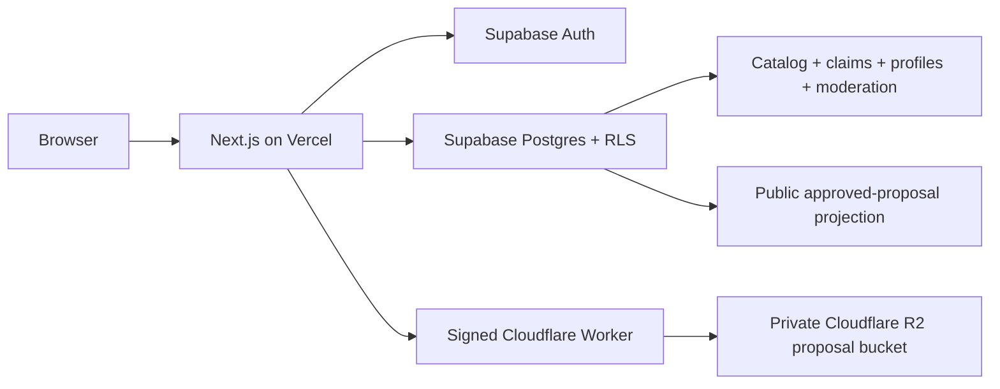
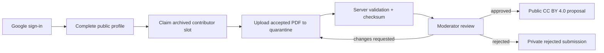

# GSoC Organizations Guide

An open-source explorer for Google Summer of Code organizations, projects, technologies, topics, historical participation, editorial guides, and moderated accepted-proposal examples.

This is an independent community project. It is not affiliated with or endorsed by Google or Google Summer of Code.

## Start here

- Live site: <https://www.gsocorganizationsguide.com>
- Repository: <https://github.com/ketankauntia/gsoc-orgs>
- Contribution guide: [CONTRIBUTING.md](CONTRIBUTING.md)
- Proposal-library guide: [docs/proposal-library.md](docs/proposal-library.md)
- Security reporting: [SECURITY.md](SECURITY.md)
- License: [LICENSE](LICENSE)
- Official GSoC source: <https://summerofcode.withgoogle.com/archive>

## What the project provides

- Search and filter 500+ archived GSoC organizations by year, topic, and technology.
- Browse project, contributor-slot, mentor, organization, yearly, and technology views.
- Explore historical data currently covering 2016 through 2025.
- Read first-party GSoC preparation guides with categories, tags, authors, RSS, sitemap, and Markdown output.
- Use public versioned catalog APIs under `/api/v1` and `/api/v2`.
- Browse approved proposal examples through the public proposal library.
- Let past contributors claim an archived project, upload an accepted proposal PDF, choose public profile fields, and submit it for moderation.
- Browse curated project blogs from selected contributors by year and organization.
- Let administrators publish contributor-authorized proposal PDFs without impersonating a contributor account.

## Architecture

The catalog is served from Supabase. MongoDB is only a one-time migration source and is not a runtime dependency.



Proposal publication is intentionally staged:



The storage gateway signs short-lived operations for only three object families: quarantine PDFs, approved proposal PDFs, and imported Google avatars. The browser never receives an R2 credential.

## Repository map

- `app/` — Next.js pages, layouts, route handlers, and API endpoints.
- `components/` — shared UI, navigation, auth, and analytics components.
- `lib/` — Supabase clients, proposal rules, storage signing, validation, cache, and data helpers.
- `supabase/migrations/` — forward database migrations and RLS/database functions.
- `lib/supabase/database.types.ts` — generated types for the linked Supabase schema.
- `cloudflare/` — checked-in proposal-storage Worker and Wrangler configuration.
- `scripts/` — catalog import, Mongo compatibility import, reconciliation, bootstrap, and storage verification.
- `new-api-details/` — checked-in canonical catalog input used by the importer.
- `docs/proposal-library.md` — public workflow, security, and contributor reference.

## Local setup

### Prerequisites

- Node.js 20 or newer.
- npm.
- A Supabase project for local application work.
- A Cloudflare R2/Worker setup only if you are exercising proposal storage.
- Git and a GitHub account for contributions.

### Install

```bash
git clone https://github.com/ketankauntia/gsoc-orgs.git
cd gsoc-orgs
npm ci
Copy-Item .env.example .env.local  # PowerShell
# cp .env.example .env.local       # macOS/Linux
```

For browsing the catalog, configure `NEXT_PUBLIC_SITE_URL`, `NEXT_PUBLIC_SUPABASE_URL`, and `NEXT_PUBLIC_SUPABASE_PUBLISHABLE_KEY`. For server-side proposal features, also configure the server-only values described below. Never commit `.env.local`, OAuth JSON, database URLs, signed URLs, or service credentials.

Start development:

```bash
npm run dev
```

Open <http://localhost:3000>.

## Environment variables

| Variable | Use | Exposure |
| --- | --- | --- |
| `NEXT_PUBLIC_SITE_URL` | Canonical origin and same-origin checks | Browser-visible |
| `NEXT_PUBLIC_SUPABASE_URL` | Supabase project URL | Browser-visible |
| `NEXT_PUBLIC_SUPABASE_PUBLISHABLE_KEY` | Supabase browser client | Browser-visible |
| `NEXT_PUBLIC_GA_MEASUREMENT_ID` | Optional GA4 page-view measurement | Browser-visible |
| `SUPABASE_SERVICE_ROLE_KEY` | Server-side catalog/admin operations | Server-only |
| `R2_GATEWAY_URL` | Signed storage gateway origin | Server-only |
| `R2_SIGNING_SECRET` | HMAC signing secret for the gateway | Server-only |

These are setup or migration inputs, not normal browser runtime values: `SUPABASE_DB_URL`, Google OAuth client credentials, `LEGACY_MONGO_DATABASE_URL`, `MONGO_DB`, `ADMIN_BOOTSTRAP_EMAILS`, `R2_ACCOUNT_ID`, `R2_BUCKET_NAME`, and the legacy `ADMIN_KEY`. Keep them out of deployed client code and public documentation.

Google Analytics is enabled only when `NEXT_PUBLIC_GA_MEASUREMENT_ID` is present. It records general page-view usage; it is not used for proposal contents, private evidence, or moderation notes. See the site's [privacy policy](https://www.gsocorganizationsguide.com/privacy-policy).

## Data and migrations

- Supabase Postgres is the runtime source of truth.
- `supabase/migrations/202608120001_proposal_library.sql` creates proposal, profile, claim, role, moderation, storage, and public-projection boundaries.
- `supabase/migrations/202608180001_admin_imports_and_contributor_blogs.sql` adds isolated administrator imports, audited contributor-blog curation, and narrow public projections.
- The canonical importer reads `new-api-details/` and validates organization/project mappings before writing.
- The Mongo importer is a one-time compatibility merge. Do not add MongoDB reads to application routes.
- Regenerate live database types after a forward migration:

```bash
npm run supabase:types:linked
```

Useful data checks:

```bash
npm run supabase:import:dry-run
npm run supabase:reconcile
```

Do not run a production import casually. Review the migration and importer output first, and preserve import audit history.

## Proposal library

The proposal feature is a privacy boundary, not a general file store:

- Google Auth creates the user identity; a contributor completes a public profile.
- Claims attach a user to an archived contributor slot and are ownership-limited by database functions and RLS.
- PDFs are structurally validated, checksummed, and promoted only after validation.
- Drafts, evidence, private notes, rejected submissions, and moderation history are protected.
- Only approved proposals appear through the narrow public projection.
- Public proposal PDFs use CC BY 4.0 attribution terms.
- Administrator imports require a real archived contributor slot, a recorded publication-rights basis, a private permission note, and the same PDF validation used by contributor uploads.
- Administrator controls are hidden from other users, while route handlers and database functions independently enforce the administrator role.

Read [docs/proposal-library.md](docs/proposal-library.md) before changing proposal routes, migrations, RLS policies, or storage behavior.

## Commands

| Command | Purpose |
| --- | --- |
| `npm run dev` | Start the local Next.js server |
| `npm run build` | Create the production build |
| `npm run start` | Serve an existing production build |
| `npm run lint` | Run ESLint |
| `npm run type-check` | Check app and Worker TypeScript |
| `npm test` | Run the test suite |
| `npm run supabase:import:dry-run` | Validate catalog inputs and checksum without writing |
| `npm run supabase:import` | Import canonical catalog data |
| `npm run supabase:import:mongo` | Merge the one-time legacy Mongo export |
| `npm run supabase:reconcile` | Compare expected and stored catalog counts |
| `npm run r2:deploy` | Deploy the signed proposal-storage Worker |
| `npm run r2:verify` | Exercise signed storage operations and cleanup |
| `npm run validate` | Run lint, type-check, tests, dry-run, and build |
| `npm run security:audit` | Audit production dependencies |

Before opening a pull request:

```bash
npm run validate
npm run security:audit
```

## Contributing

1. Fork the repository and create a branch from `master`.
2. Use a focused branch name such as `feat/search-filter`, `fix/api-cache`, or `docs/contributing`.
3. Read the relevant route, component, migration, and public/private-data boundary before editing.
4. Keep changes small and typed. Add or update tests for behavior changes.
5. Run `npm run validate` and `npm run security:audit` locally.
6. Commit with a [Conventional Commit](https://www.conventionalcommits.org/) subject, for example `fix(api): handle empty year data`.
7. Push your branch and open a pull request. Do not commit directly to `master`.

Pull requests should explain:

- what changed and why;
- how it was tested;
- whether a migration, environment variable, or deployment change is required;
- whether public docs or the changelog need an update; and
- whether the change touches authentication, RLS, private data, storage, or analytics.

Do not include secrets, private proposal contents, private moderation records, raw database exports, signed URLs, or local agent-tooling directories in a pull request.

## Analytics and privacy

The app uses Vercel Analytics and Speed Insights, plus optional GA4 configured by `NEXT_PUBLIC_GA_MEASUREMENT_ID`. Analytics is limited to aggregate website operation and page-view understanding. Do not add identity-linked contributor monitoring, proposal-content tracking, or hidden behavioral profiles. Update the privacy policy when analytics behavior changes.

## Reporting security issues

Do not open a public issue for a vulnerability. Follow [SECURITY.md](SECURITY.md) and report privately.

## License

This repository uses the custom non-commercial source license in [LICENSE](LICENSE). Read it before reusing the code or submitting a contribution.
