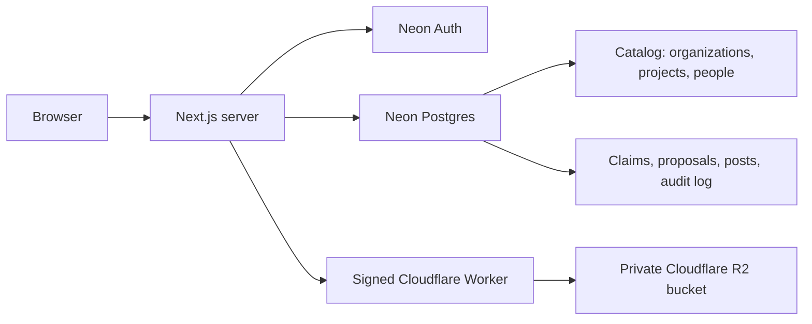
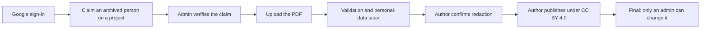

# GSoC Organizations Guide

An open-source explorer for Google Summer of Code organizations, projects, technologies, topics, historical participation, editorial guides, and moderated accepted-proposal examples.

This is an independent community project. It is not affiliated with or endorsed by Google or Google Summer of Code.

## Start here

- Live site: <https://www.gsocorganizationsguide.com>
- Repository: <https://github.com/ketankauntia/gsoc-orgs>
- Contribution guide: [CONTRIBUTING.md](CONTRIBUTING.md)
- Proposal-library guide: [docs/proposal-library.md](docs/proposal-library.md)
- Security reporting: [SECURITY.md](SECURITY.md)
- License: [LICENSE](LICENSE)
- Official GSoC source: <https://summerofcode.withgoogle.com/archive>

## What the project provides

- Search and filter 500+ archived GSoC organizations by year, topic, and technology.
- Browse project, contributor-slot, mentor, organization, yearly, and technology views.
- Explore historical data currently covering 2016 through 2025.
- Read first-party GSoC preparation guides with categories, tags, authors, RSS, sitemap, and Markdown output.
- Use public versioned catalog APIs under `/api/v1` and `/api/v2`.
- Browse approved proposal examples through the public proposal library.
- Let past contributors and mentors claim the archived project they took part in. After verification, contributors publish the accepted proposal that got them selected.
- Let contributors link the progress posts (weekly updates, reports, talks) they wrote during GSoC.
- Let administrators verify claims, publish proposals with recorded permission, and hide posts.

## Architecture

The catalog and contributor content live in Neon Postgres; sign-in uses Neon Auth (managed Better Auth) with Google. Only the Next.js server talks to the database.


```mermaid
flowchart LR
  Browser[Browser] --> Next[Next.js server]
  Next --> Auth[Neon Auth]
  Next --> DB[Neon Postgres]
  Next --> Gateway[Signed Cloudflare Worker]
  Gateway --> R2[Private Cloudflare R2 bucket]
  DB --> Catalog[Catalog: organizations, projects, people]
  DB --> Hub[Claims, proposals, posts, audit log]
```

A proposal reaches the public site in steps:


```mermaid
flowchart LR
  SignIn[Google sign-in] --> Claim[Claim an archived person on a project]
  Claim --> Verify[Admin verifies the claim]
  Verify --> Upload[Upload the PDF]
  Upload --> Check[Validation and personal-data scan]
  Check --> Confirm[Author confirms redaction]
  Confirm --> Publish[Author publishes under CC BY 4.0]
  Publish --> Final[Final: only an admin can change it]
```

Each proposal has exactly one stored file, `proposals/<id>.pdf`; a replacement overwrites it. The storage gateway signs short-lived operations for quarantine uploads, proposal files and imported Google avatars. The browser never receives an R2 credential.

## Repository map

- `app/` — Next.js pages, layouts, route handlers, and API endpoints.
- `components/` — shared UI; `components/hub/` holds the account and admin screens.
- `lib/` — database and auth clients, contributor-hub queries, storage signing, validation, and data helpers.
- `db/migrations/` — forward-only SQL migrations, applied with `npm run db:migrate`.
- `cloudflare/` — the proposal-storage Worker, its Wrangler configuration, and R2 CORS and lifecycle rules.
- `scripts/` — catalog import, reconciliation, verification, and storage checks.
- `new-api-details/` — checked-in canonical catalog input used by the importer.
- `docs/proposal-library.md` — public workflow, security, and contributor reference.

## Local setup

### Prerequisites

- Node.js 20 or newer.
- npm.
- A Neon project (a development branch is enough) with Neon Auth enabled, for account and database work.
- A Cloudflare R2/Worker setup only if you are exercising proposal storage.
- Git and a GitHub account for contributions.

### Install

```bash
git clone https://github.com/ketankauntia/gsoc-orgs.git
cd gsoc-orgs
npm ci
Copy-Item .env.example .env.local  # PowerShell
# cp .env.example .env.local       # macOS/Linux
```

Most pages build from the checked-in JSON and need no database. For the APIs, proposals and accounts, configure the database and auth values described below, then run `npm run db:migrate` and `npm run db:import-catalog`. Never commit `.env.local`, OAuth JSON, database URLs, signed URLs, or service credentials.

Start development:

```bash
npm run dev
```

Open <http://localhost:3000>.

## Environment variables

| Variable | Use | Exposure |
| --- | --- | --- |
| `NEXT_PUBLIC_SITE_URL` | Canonical origin and same-origin checks | Browser-visible |
| `NEXT_PUBLIC_GA_MEASUREMENT_ID` | Optional GA4 page-view measurement | Browser-visible |
| `NEON_DATABASE_URL` | Neon pooled connection string for the app | Server-only |
| `NEON_DATABASE_URL_UNPOOLED` | Neon direct connection string for migrations and scripts | Server-only |
| `NEON_AUTH_BASE_URL` | Neon Auth endpoint for the branch | Server-only |
| `NEON_AUTH_COOKIE_SECRET` | Signs session cookies; at least 32 characters | Server-only |
| `ADMIN_USER_IDS` | Comma-separated Neon Auth user ids with admin access | Server-only |
| `R2_GATEWAY_URL` | Signed storage gateway origin | Server-only |
| `R2_SIGNING_SECRET` | HMAC signing secret for the gateway | Server-only |

`R2_ACCOUNT_ID`, `R2_BUCKET_NAME` and the legacy `ADMIN_KEY` are operational inputs, not runtime browser values. Google OAuth client credentials are configured in Neon Auth, not in this app. Keep all of them out of client code and public documentation.

Google Analytics is enabled only when `NEXT_PUBLIC_GA_MEASUREMENT_ID` is present. It records general page-view usage; it is not used for proposal contents, private evidence, or moderation notes. See the site's [privacy policy](https://www.gsocorganizationsguide.com/privacy-policy).

## Data and migrations

- Neon Postgres is the runtime source of truth for the APIs and contributor content.
- `db/migrations/0001_catalog.sql` creates the catalog: organizations, projects, the people listed on each project (`project_people`), and the technology/topic vocabulary.
- `db/migrations/0002_contributor_hub.sql` creates profiles, claims (`participations`), proposals, posts, the audit log, the functions every write goes through, and the public views.
- The canonical importer reads `new-api-details/` and validates organization/project mappings before writing.
- Apply migrations and load the catalog:

```bash
npm run db:migrate
npm run db:import-catalog
```

Useful data checks:

```bash
npm run db:import-catalog:dry-run
npm run db:reconcile
npm run db:verify-taxonomy
```

Do not run a production import casually. Review the migration and importer output first, and preserve import audit history.

## Proposal library

The proposal feature is a privacy boundary, not a general file store:

- Google sign-in through Neon Auth creates the identity. Profiles are private unless the owner makes them public.
- A claim attaches an account to one person in Google's archive (a contributor or a mentor). GSoC's rules are enforced in the database: at most two contributor claims, never contributor and mentor in the same year, and no contributing after mentoring.
- Proposal uploads open once the claim is verified. PDFs are validated, checksummed and scanned for emails and phone numbers; the author confirms redaction for the exact file before publishing.
- Publishing is final for the author; after that only an administrator can replace or remove the file, and the author can request removal.
- Progress posts are links only and appear immediately, marked "Not verified" until the claim is verified.
- Notes, evidence, extracted proposal text and the audit log are never exposed through public views.
- Public proposal PDFs use CC BY 4.0 attribution terms.
- Administrators are listed by user id in `ADMIN_USER_IDS`; route handlers check it before calling the admin database functions, which record every action.

Read [docs/proposal-library.md](docs/proposal-library.md) before changing proposal routes, migrations, RLS policies, or storage behavior.

## Commands

| Command | Purpose |
| --- | --- |
| `npm run dev` | Start the local Next.js server |
| `npm run build` | Create the production build |
| `npm run start` | Serve an existing production build |
| `npm run lint` | Run ESLint |
| `npm run type-check` | Check app and Worker TypeScript |
| `npm test` | Run the test suite |
| `npm run db:migrate` | Apply pending SQL migrations |
| `npm run db:import-catalog:dry-run` | Validate catalog inputs and checksum without writing |
| `npm run db:import-catalog` | Import canonical catalog data |
| `npm run db:reconcile` | Compare expected and stored catalog counts |
| `npm run r2:deploy` | Deploy the signed proposal-storage Worker |
| `npm run r2:verify` | Exercise signed storage operations and cleanup |
| `npm run validate` | Run lint, type-check, tests, dry-run, and build |
| `npm run security:audit` | Audit production dependencies |

Before opening a pull request:

```bash
npm run validate
npm run security:audit
```

## Contributing

1. Fork the repository and create a branch from `master`.
2. Use a focused branch name such as `feat/search-filter`, `fix/api-cache`, or `docs/contributing`.
3. Read the relevant route, component, migration, and public/private-data boundary before editing.
4. Keep changes small and typed. Add or update tests for behavior changes.
5. Run `npm run validate` and `npm run security:audit` locally.
6. Commit with a [Conventional Commit](https://www.conventionalcommits.org/) subject, for example `fix(api): handle empty year data`.
7. Push your branch and open a pull request. Do not commit directly to `master`.

Pull requests should explain:

- what changed and why;
- how it was tested;
- whether a migration, environment variable, or deployment change is required;
- whether public docs or the changelog need an update; and
- whether the change touches authentication, RLS, private data, storage, or analytics.

Do not include secrets, private proposal contents, private moderation records, raw database exports, signed URLs, or local agent-tooling directories in a pull request.

## Analytics and privacy

The app uses Vercel Analytics and Speed Insights, plus optional GA4 configured by `NEXT_PUBLIC_GA_MEASUREMENT_ID`. Analytics is limited to aggregate website operation and page-view understanding. Do not add identity-linked contributor monitoring, proposal-content tracking, or hidden behavioral profiles. Update the privacy policy when analytics behavior changes.

## Reporting security issues

Do not open a public issue for a vulnerability. Follow [SECURITY.md](SECURITY.md) and report privately.

## License

This repository uses the custom non-commercial source license in [LICENSE](LICENSE). Read it before reusing the code or submitting a contribution.
